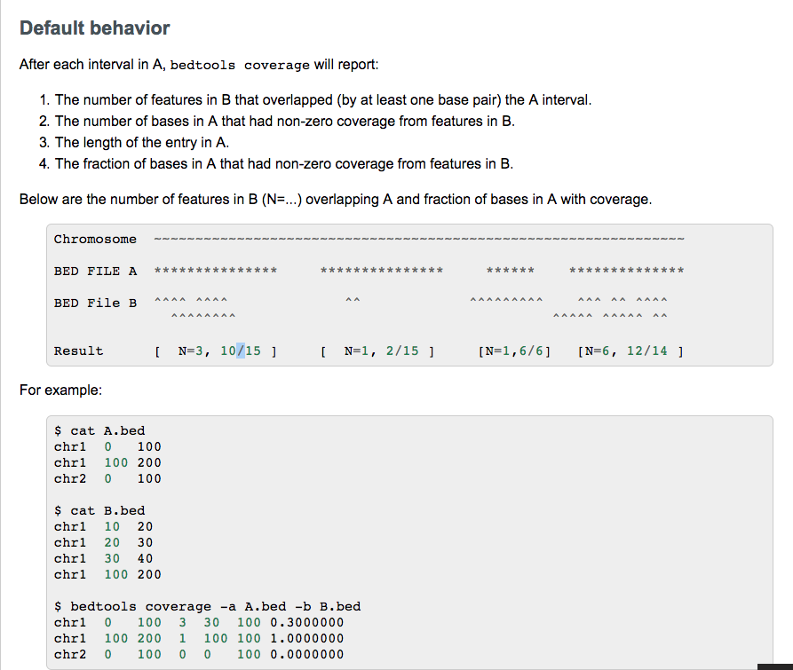

## Planning 

+ [_GTEx_](https://www.ncbi.nlm.nih.gov/pmc/articles/PMC4010069/)
    + _abstract_ 
        + GWAS identify loci for common disease, mechanism remain unknown
        + most variants not in protein-coding region, 
            + suggests polymorphism in regulatory region likely contribute
        +  hence important to test gene expression and its relationship to genetic variantion
            + can look at cell context, which is a source of gene regulation 
        + However some types of tissues are difficult to sample 
            + Solution: GTex, database and tissue bank to study gene variation and gene expression in human tissues 
    + _definitions_ 
        + _quantitative trait_ 
            + phenotypes vary in degree attributable to polygenic effects, (i.e. product of two or more genes)
        + _quantitative trait locus (QTL)_
            +  a section of DNA (the locus) that _correlates_ with variation in a phenotype (the quantitative trait)
            + QTL is linked to genes that control that phenotype 
            + achieved by identifying SNP that correlate with an observed trait 
        + _expression quantitative trait locus (eQTL)_
            + genomic loci that contribute to variation in expression levels of mRNA
            + _local eQTLS_ 
                + cis-acting locus mapped to gene of origin 

            + _distant eQTLS_ 
                + trans-acting locus mapped far from location of gene of origin 
                + tissue-dependent
        + _reads per kilobase million (RPKM)_ 
            + a method of _quantifying gene expression_ from RNA sequencing data by normalizing for 
                + sample sequencing depth
                + gene length
            + [Mapping and quantifying mammalian transcriptomes by RNA-Seq.](https://www.ncbi.nlm.nih.gov/pubmed/18516045)
            + `RPKM = numReads / ( geneLength/1000 * totalNumReads/1,000,000 )`
    + _website_ 
        + Gene 
            + gene expression graph for each tissue (measured in RPKM)
            + exon expression for each tissue
                + collapsed transcript model 
                + ranked in order of expression
            + significant single-tissue eQTLs for each tissue
        + what is important?
        + display 
        + database 
            + about 57 Gb for everything 
            + 5Gb for expression only 
    + _data-set_ 
        

+ _description_
    + goal 
        + gather data from [gtex](https://www.gtexportal.org/home/datasets) 
            + `.bam` files for acquiring raw counts
            + how to generate raw counts?
                + exon coordinates for protein coding gene /home/naumenko/Desktop/reference_tables/protein_coding_genes.exons.bed
                    + generatedd with [this](https://github.com/naumenko-sa/bioscripts/blob/master/genes.R) script
                + calculate coverage for a gene with [bam.gene_coverage.sh](https://github.com/naumenko-sa/bioscripts/blob/master/bam.gene_coverage.sh)
        + search for gene panel
        + gene panel page display 
            + coverage plot for exons 
                + specifically when selecting two tissues, outputing a bar plot of absolute read counts 
            + ranking of which tissues is best? 
                + express gene of interest (phenopredict)
                    + minimal level?
                    + just for detecting mutation
                + cover all exons interested 
                    + perhaps not the exact variant 
                    + but all exons of interested 
                    + minimal exons 
        + novel mutation study 
            +   
    + interface 
        + selection by panel 
    + definition 
        + panel 
            + a set of genes 
    + gtex 
        + 9000 samples over 30 tissue

+ _bed_ 
    + browser extensible data. 
    + define data lines that are displayed in an annotation track
    + 
+ `bedtools` 
    + `-a`: query file 
        + convention is to report result with respect to query file 
    + `-b`: database file 
    + `-wa` and `-wb`: write 
    + `-c`: count 
+ `bedtools coverage`
    + computes both _depth_ and _width_ of coverage of features in file B on features in file A
        + `-a`: sequence alignments 
        + `-b`: target features
    + counts number of features tha toverlap an interval in file A, also computes fraction of bases in interval in A that were overlapped by one or more features
    + 

---

## Todos 
+ _collection summary_
    + 71476 x 12 (headers)
    + headers
        + 71476 `sampleId`: `GTEX-111CU-1826-SM-5GZYN`
            + `GTEX-111cU`: donor ID
                + link Rnaseq to genotype 
            + `1826`: tissue site
            + `SM-5GZYN`: RNA aliquot ID for sequencing
        + 959 `subjectId`
        + 6 `materialType`
            + interested in `RNA:Total RNA` and perhaps `DNA:DNA Genomic`
        + 30 distinct `tisueSite`
        + 53 distinct `tissueSiteDetail`
+ _gene expression data_   
    + [download](https://www.gtexportal.org/static/datasets/gtex_analysis_v6p/rna_seq_data/GTEx_Analysis_v6p_RNA-seq_RNA-SeQCv1.1.8_gene_reads.gct.gz)
    + 50000 genes x 53 tissue types 
    + not relevant 
+ _exon expression data_
    + _annotations_ 
        + _GTEx_Data_V6_Annotations_SampleAttributesDS.txt_: 
            + sample annotation 
                + `SAMPID`: sample Id i.e. `GTEX-1117F-0003-SM-58Q7G`
                + `SMTS`: tissue type, area from which tissue sample was taken
                + `SMTSD`: tissue type, more specific detail
                + `SMEXNCRT`: exonic rate
                + `SMRDLGTH`: read length
                + ...
        + _GTEx_Data_V6_Annotations_SubjectPhenotypesDS.txt_ 
            + subject phenotype annotation 
            + columns  
                + `SubjectId`, i.e. `GTEX-1117F`
                + `AGE`
                + `GENDER`
                + ...
    + [download](https://www.gtexportal.org/static/datasets/gtex_analysis_v6/rna_seq_data/GTEx_Analysis_v6_RNA-seq_RNA-SeQCv1.1.8_exon_reads.txt.gz)
    + 300000 exons x 8556 samples
        + samples has a mapping 
    + figure out if its raw counts
        + it is unnormalized. If a read overlapped multiple exons, then a fractional value equal to the portion of read contained within that exon was allotted
    + just group samples by tissue and infer if its significantly above a minimum threshold. 
    + exon id `.10_1` maybe different exon number on positive/negative strand 
