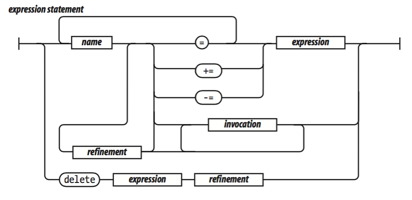
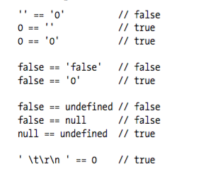
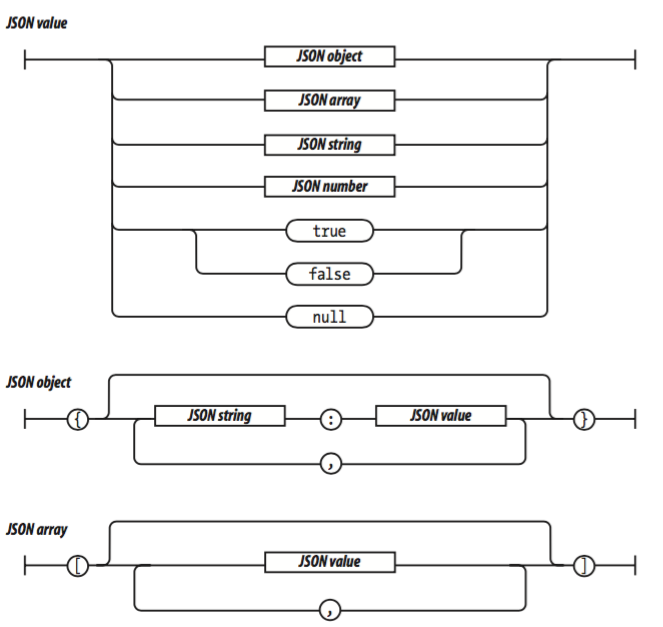
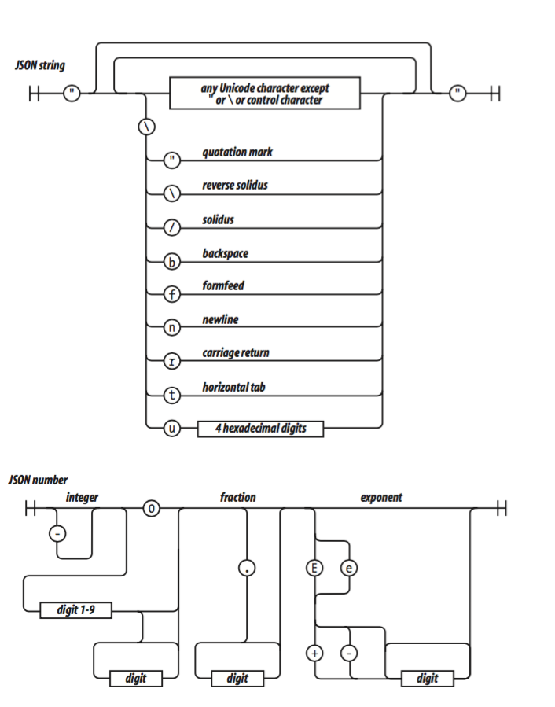

# [JavaScript: The Good Parts](js_good_part.pdf) Notes

## Overview
+ the good
  + loose type
  + expressive object literal
    + `Object` can be created by listing components
  + function
    + _first-class object_, i.e.
      + an instance of Object
      + have properties and link back to constructor method
      + store function in a variable
      + pass function as parameter to another function
      + return function from a function
    + _lexical (static) scoping_
      + name resolution depends on location in source code and lexical context, defined by where variable/function is defined
        + variable definition resolved by searching its containing block or function, search outer blocks if failed
      + _vs. dynamic scoping_:
        + calling function is searched instead, then function which calls that calling function, and so on. progressing up call stack
  + _lambda language_
    + function with no names, as callbacks
  + _prototypal inheritance_
    + class free object system in which objects inherit properties directly from other objects.
+ the bad
  + _global object_
    + JS depends on global variable for linkage
    + global variables


## Grammar
+ _names_
  + reserved
    + `undefined`
    + `NaN`
    + `Infinity`
+ _numbers_
  + 64-bit float (`double`) only
    + `1` and `1.0` is equivalent
    + Avoids short int overflow
  + `NaN`: result of operation that cannot produce normal result
    + test with `isNaN(number)`
  + `Infinity`: `1.797...e+308`
  + `Math.floor(number)`
+ _strings_   
  + 16-bit Unicode `char`
  + `'` and `"` are equivalent
  + escape chars `\`
    + `"` and `'`: quotes
    + `\` and `/`: slashes
    + `b`: backspace
    + `f`: form feed
    + `n`: new line
    + `r`: carriage return
    + `t`: tab
    + `u`: 4 hex digits
      + `"A" = "\u0041"`
  + properties
    + `"foo".length`
  + _immutable_
+ _statements_
  + types
    + `var`: private variables declaration
    + `if`, `switch`: conditional
    + `while`, `for`, `do`: loop
    + `break`, `return`, `throw`: function invocation
  + _block_
    + set of statements wrapped in `{}`
    + block does not create a new scope,
      + so variables should defined at top of function, not in blocks
  + conditional requires evaluating _expression_ not _statement_
    + _falsy values_
      + `false`
      + `null`
      + `undefined`
      + empty string `''`
      + number `0`
      + number `NaA`
    + _truthy values_
      + all other values
      + `true`
      + string `'false'`
      + any objects
  + `object.hasOwnProperty(variable)`
    + determine if property name is a member of object or was found instead on protype chain
  + _expression statement_
    + 
+ _expression_
  + 
  + _operator precedence_
    + 
  + _prefix operator_
    + 
    + `typeof`  
      + `number`, `string`, `boolean`, `undefined`, `function`, `object`
      + Note array or `null` evaluates to `object`
    + `+`: add numbers or concat strings
  + _infix operator_
    + 
  + _invocation_ on function
  + _refinement_: property or element of object or array
+ _literal_
  + convenient notation for specifying new objects
  + 
  + _object literal_
    + 
  + _array literal_
    + 
  + _regex literal_
    + 
  + _function literal_
    + 
    + `function foo (arg1, arg2) {}`


## Objects
+ Type
  + `number`, `sting`, `blloean`, `null`, `undefined`
    + object-like with member methods
    + immutable
  + `object`
    + mutable keyed collections; a container or properties
      + `key` `value` pair, where `key` is any string and `value` is any value except for `undefined`
    + i.e.
      + `array`, `function`, `regex`
    + class-free,
    + prototype linkage inheritance
+ _object literal_
  + a pair of curly braces surrounding 0 or more name/value pairs
    + name: any string
  + nestable
  + _retrieval_
    + wrapping string expression in `[]` suffix or simply `.` if `key` is a legal name
    + return `undefined` if were to retrieve nonexistent member  
      + `||` to fill in default value
      + `var l = box["length"] || 0`
    + throw `TypeError` exception if were to retrieve values from `undefined`
      + `&&` to guard
      + `flight.equipment && flight.equipment.model`
  + _update_ by assignment
  + _reference_
    + objects are passed by reference, never copied!
    + `var x = y; x.z = foo; var u = y.z`, now `u` is `foo`
+ _prototype_
  + Every object linked to a prototype from which it can inherit properties
    + all object literal are linked to `Object.prototype`, an object
    + update does not change object's prototype
  + _delegation_
    + During object retrieval, if object is lacking in property, it goes to its prototype and so on until process goes to `Object.prototype`, if no desired property exists, returns `undefined`
  + _dynamic_
    + addition of property to prototype will be immediately visible to all of objects that are based on that prototype
+ _reflection_
  + inspect object to determine what property it has
  + `typeof` operator
    + determine type of property
    + However, will search the entire prototypal chain for the property, undesirable
    + _solution_
      1. rejecting function value
      2. `hasOwnProperty`:
        + return `true` if object has property
        + does not look at prototype chain
+ _enumeration_
  + enumerating properties of an object using `for in` statement
    + inclusion of property from prototype chain
    + filter out values with
      + `hasOwnProperty`
      + `typeof`
    + `for(name in obj){ if(typeof obj[name] != 'function'){}}`
+ _delete_
  + removal of a property from object
    + does not touch objects in prototype linkage
    + may allow prototype property to shine through upon removal
+ _global abatement_
  + global variables should be avoided
  + minimize use of global variable by creating a single global variable for application
    + `var APP = {}`


## Functions
+ definition
  + enclose a set of statements
  + modular unit for code reuse, info hiding, composition  
+ _function object_
  + are object and hence are linked to its prototype called `Function.prototype`, which is linked to `Object.prototype`
  + created with additional two properties
    + context  
    + codes that implements behavior
    + `.prototype`
      + an object with a `constructor` property
      + `.prototype.constructor` is a function
  + Since function is object
    + store in variables, objects, arrays
    + passed as args and returned from function
    + function can have methods...
  + _invocation_
+ _function literal_
  + `var add = function(a, b){ return a + b; }`
  + components
    + `function` keyword
    + name (special case: anonymous)
    + parameters
    + statements wrapped in `{}`
  + _closure_
    + function created by function literal contains link to the outer context, hence able to access parameters and variables of function it is nested within
+ _invocation_
  + pair of parenthesis containing comma separated list of _expressions_
  + parameter
    + parameter passed to function
    + `this`
      + determined by _invocation pattern_
    + `arguments`
  + no error for difference in number of arguments and parameters
    + too many args, extra ignored
    + too few args, the rest defaults to `undefined`
  + no type check on argument values
+ _invocation pattern_
  + _method invocation pattern_
    + _method_
      + a function that is stored as property of an object
      + a _public method_ is a method that get their object context from `this`
    + _invocation_
      + with use of _refinement_ in expression i.e. `.` or `[]`
      + `this` is bounded to that object
        + used to retrieve values from object or modify the object
      ```js
      // create myObj,
      var myObj = {
        value: 0,
        increment: function(inc){
          this.value += typeof inc === 'number' ? inc : 1;
        }
      }

      myObj.increment()   // 1
      myObj.increment(2)  // 3
      ```
    + _function invocation pattern_
      + _invocation_
        + invoked as a function, which is not a property of an object
        + `this` is bound to global object
        + i.e. `var sum = add(3, 4);`
      + _bad design_
        + for invocation of an inner function, `this` would still be bound to `this` of the outer function, irrespective where it is called.
        + method cannot employ an inner function to help it do its work because inner function does not share the method's access to the object
      + _workaround_
        ```js
          obj.double = function(){
            var that = this;
            var helper = function(){
              that.value = add(that.value, that.value);
            }
            helper();
          }
          ```
    + _constructor invocation pattern_
      + JS is prototypal inheritance language, but still supports object-making syntax for a classical language
      + _constructor_
        + function to be used with `new` prefix
      + _invocation_
        + function invoked with `new` prefix, then a new object will be created with a hidden link to value of function's `.prototype` member,
        + `this` will be bound to that new object
        +
         ```js
          //Constructor, object with status property
          var Quo = function(string){
            this.status = string;
          }
          // public method
          Quo.prototype.get_status = function(){
            return this.status;
          }
          // instance of Quo
          var myQuo = new Quo("confused");
          myQuo.get_status();
          ```
      + not recommended
    + _apply invocation pattern_
      + function is an object and hence has method
      + `fun.apply(thisArg, [argsArray])`
        + used to construct an array of args to use to invoke a function
        + `thisArg`:
          + value of `this` provided for the call to `fun`.
          + what value bounded to `this`
        + `[argArray]`
          + an array of params, or `null` or `undefined` if no arguments are provided
      +

        ```js
        var array = [3, 4];
        var sum = sum.apply(null, array);
        ```
        ```js
        var statusObj = {
          status: 'A-OK'
        };
        /* statusObj does not inherit Quo.prototype, but still can invoke Quo.prototype.get_status() method on statusObj even though statusObj does not have get_status() method */
        var status = Quo.prototype.get_status.apply(statusObj);
        ```
+ _arguments_
  + an array-like (with `.length` property only, not an array object) containing all arguments supplied during invocation, including excess args not assigned to parameters
    + available to function when invoked  
    + able to write function that takes unspecified number of parameters
    ```js
    // function that adds a lot of stuff
    var sum = function(){
      var i, sum = 0;
      for(i = 0; i < arguments.length; i += 1){
        sum += arguments[i];
      }
      return sum;
    }
    sum(4,1,3,6,7);
    ```
  + not really useful since can just pass in array instead
+ _return_
  + function always returns a value, if `return` not specified `undefined` is returned
  + function (constructor) invoked with `new` and return value is not object, then `this` (i.e. the new object) is returned instead
+ _Exceptions_
  + unusual mishaps interfering with normal program flow.
    ```js
    var add = function(a, b){
      if(typeof a !== 'number' || typeof b !== 'b'){
        throw {
          name: 'TypeError',
          message: 'add needs numbers'
        };
      }
      return a + b;
    }
    ```
  + `throw exceptionObj`
    + `exceptionObj`
      + `name` property and identifies type of exception
      + `message`
    + delivered to `catch`
      ```js
      var try_it = function(){
        try{
          add("seven");
        } catch(e){
          document.writeln(e.name + ':' + e.message);
        }
      }
      ```
+ _type augmentation_
  + adding method to `.prototype` makes that method available to all objects
    ```js
    Function.prototype.method = function(name, func){
      this.prototype[name] = func;
      return this;
    }

    // extract just int part of the Number
    Number.method('integer', function(){
      return Math[this < 0 ? 'ceiling' : 'floor'](this);
    })

    (-10 / 3).integer()   // -3

    // remove space from end of string
    String.method('trim', functino(){
      return this.replace(/^\s+|\s+$/g, '')
    })
    ```
  + add a method only if method is known to be missing
    ```js
    Function.prototype.method = function(name, func){
      if(!this.prototype[name]){
        this.prototype[name] = func;
      }
    }
    ```
+ _recursion_
  ```js
  var walk_the_dom = function walk(node, func){
    func(node);
    node = node.firstChild;
    while(node){
      walk(node);
      node = node.nextSibling;
    }
  }
  ```
  ```js
  // takes var get attr name and amtch value, call
  // walk_the_dom, passing it a function that looks for
  // attr function in node, matching node accumulated in resulting array
  var getElementByAttribute = function(attr, value){
    var results = [];
    wlak_the_dom(document.body, function(node){
      var actual = node.nodeType == 1 && node.getAttribute(attr);
      if(typeof actual === 'string' &&
          (actual === value || typeof value != 'string')){
            result.push(node);
          }
    })
    return results;
  }
  ```
+ _scope_     
  + controls visibility and lifetimes of variables and parameters
    + reduce namespace collision
    + automatic memory management
  + JS
    + lexical scope instead of block scope
      + i.e. `if` statement is a block; variable defined in `if` block is visible outside of `if` statement
    + have function scope
    + hence better to declare all variable used in functino at top of function body
    + [understanding scope by examples](http://stackoverflow.com/questions/500431/what-is-the-scope-of-variables-in-javascript)
  + _block scope_
    + variables defined in block `{}` are not visible from outside of block
  + _lexical scope_
    + defines how variable names are resolved in nested functions
    + inner functions contain the scope of parent functions even if the parent function has returned.
  + _function scope_
    + parameters and variables defined in function are not visible outside of the function
    + variable defined anywhere in function is visible everywhere in function
+ _closure_
  + functions that refer to independent variables (used locally but defined in enclosing scope)
    + a combination of function and its lexical environment within which that function was declared
      + lexical environment consists of any local variable that were in-scope at moment the closure is created
    + i.e. function remembers the environment in which they were created
  + Examples
    ```js
    // initialize `myObj` by calling function that returns object literal.
    var myObj = function(){
      var value = 0;
      return {      // returns an object literal
        increment: function(inc){
          value += typeof inc === 'number' ? inc : 1;
        },
        getValue: function(){
          return value;
        }
      }
    }();            // assigning result of function call
    ```
    + Note
      + shared lexical env is created in body of anonymous function that is executed as soon as it has been defined
        + lexical env contains variable `value` and 2 functions, accessible only with returned `public` methods
      + `value` is always available to `increment` and `getValue`, but function's scope keeps it hidden from rest of program
        + hence `value` is made private by function scoping
      + By virtues of closure, `value` persists even if the function finished initializing `value` and returns.
        + inner functions `increment` and `getValue` maintains a reference to its lexical env, within which the variable `value` exists
        + hence `value` remains available for use
    ```js
    var quo = function(status){
      return {
        get_status: function(){
          return status;
        }
      };
    };
    var myQuo = quo("amazed")  
    ```
    + Note
      + `new` operator not necessary
      + `myQuo.status` not allowed, hence `status` becomes private
      + `myQuo.get_status()` returns reference to original parameter passed into function
    ```js
    // define function that sets DOM node's color to yellow
    // and fades it to white
    var fade = function(node){
      var level  = 1;
      var step = function(){
        var hex = level.toString(16);
        node.style.backgroundColor = '#FFF' + hex + hex;
        if(level < 15){
          level += 1;
          setTimeout(step, 100);
        }
      };
      setTimeout(step, 100);
    };

    fade(document.body);
    ```
    + Note
      + inner function `step` has access to actual varaible of outer function `level` and not copies
    ```js
    /* Function that assigns event handler to array of nodes, when clicked, alert box supposed to display ordinal of node, but always display number of nodes instead. The undesired behavior is a result of the fact that event handler retains reference not copies of variable i, which is incremented until it holds size of array. */
    var wrong_add_handler = function(nodes){
      var i;
      for(i = 0; i < nodes.length; i++){
        nodes[i].onclick = function(e){
          alert(i);
        }
      }
    }
    ```
    + fails because handler functions are bound to variable `i`, not value of `i` at time function is made
    ```js
    var correct_add_handler = function(nodes){
      var i;
      for(i = 0; i < nodes.length; i++){

        nodes[i].onclick = function(i){
          return function(e){
            alert(e);
          };
        }(i);

      }
    }
    ```
    + correct: define a function and immediately invoke it. The function will return event handler function that is bound to value of `i` that was passed in, not to the `i` defined in the outer function.
      + js pass by value, hence `i` is copied to lexical env of inner event handler function
  + _application_
    + ability to associate data (lexical env) with functions that operates on the data
    + emulating private variable with closures
      + i.e. can be called by other methods in same class
      + previous counter example
    + _performance_
      + object creation duplicates methods...
      + so define methods in `prototype` if closure not needed
+ _callbacks_
  + async request with callback function to be invoked when response is received.
    ```js
    send_request_async(request, funtion(res){
      display(res);
    })
    ```
+ _module_
  + a function or object that presents an interface but hides its state and implementation.
    + avoid use of global variable  => encapsulation
  ```js
  String.method('deentityify',function(){
    // local entity table
    var entity = {
      quot: '"',
      lt: '<',
      gt: '>'
    }
    return function(){

      return this.replace(/&([^&;]+);/g,
        function(a,b){
          var r = entity[b];
          return typeof r === 'string' ? r : a;
        }
      )
    };
  }())
  ```
  + module pattern  
    + a function that defines private variables and functions
    + creates (returns) public function, through closure, will have access to private variables and functions
+ _cascade_
  + when methods that set/change state of an object returns `this`
    + result of invocation can be used for next invocation
  ```js
  getElement('myBoxDiv')
      .move(350, 150)
      .width(100)
      .height(100)
      .on('mousemove', 'drag')
      ...
  ```
+ _curry_
  + produce a new function by combining a function and an argument
  ```js
  Function.method('curry', function(){
    var slice = Array.prototype.slice,
        args = slice.apply(arguments),
        that = this; // so that returned function 'this' bound to original function

    return function(){
      return that.apply(null, args.concat(slice.apply(arguments)))
    }
  })
  ```
+ _memoization_
  + function can use objects to remember the result of previous operation, avoiding doing unnecessary work
    + use the fact that variable in lexical context is referenced
  ```js
  var fibonacci = function(){
    var memo = [0, 1];
    var fib = function(n){
      var result = memo[n];     
      if(typeof result !== 'number'){ // do operation if not already
        result = fib(n-1) + fib(n-2);
        memo[n] = result;
      };
      return result;
    };
    return fib
  }();
  ```


## Inheritance
+ _pseudoclassical_
  + objects are produced by constructor methods
  + `this.prototype = {constructor: this};`
    + a new function object is given a prototype property whose value is an object containing constructor property whose value is the new function object.
    + every function gets a `.prototype` object, where inherited traits are to be deposited
      + this is done because there is no way determining if a function is intended for object creation
  + `new` object creation implementation
    ```js
    Function.method('new', function(){
      // create new object that inherits from constructor's prototype
      var that = Object.create(this.prototype);

      // Invoke constructor, binding this to new object
      var other = this.apply(that, argument)

      // if return value isnt an object substitute the new object
      return (typeof other === 'object' && other) || that;
    })
    ```
  + Example of inheritance
    ```js
    // define constructor and augment its prototype
    var Mammal = function(name){
      this.name = name;
    }
    Mammal.prototype.get_name = function(){
      return this.name;
    }
    Mammal.prototype.says = function(){
      return this.saying || '';
    }

    // creating an instance
    var myMammal = new Mammal('herb the mammal');
    var name = myMammal.get_name()    // 'herb the mammal'

    // inheriting from Mammal by defining its constructor function
    var Cat = function(name){
      this.name = name;
      this.saying = 'meow';
    }
    // replacing its prototype with an instance of mammal
    Cat.prototype = new Mammal();   

    // augment prototype with purr and get_name
    Cat.prototype.purr = function(n){
      var i, s = '';
      for(i = 0; i < n; i++){
        if(s){
          s += '-';
        }
        s += 'r';
      }
      return s;
    };

    Cat.prototype.get_name = function(){
      return this.says() + ' ' + this.name + ' ' + this.says();
    }

    var myCat = new Cat('Henrietta');
    var says = myCat.says()   // 'meow'
    var purr = myCat.purr(5)  // `r-r-r-r-r`
    var name = myCat.get_name();  // `meow Henrietta meow`
    ```
    + 
    + using `inherit` and cascading
    ```js
    Function.method('inherits', function(Parent){
      this.prototype = new Parent();
      return this;
    })

    var Cat = function(name){
      this.name = name;
      this.saying = 'meow';
    }
      .inherits(Mammal)
      .method('purr', function(n){
        var i, s = '';
        for(i = 0; i < n; i++){
          if(s){
            s += '-';
          }
          s += 'r';
        }
        return s;
      })
      .method('get_name', function(){
        return this.says() + ' ' + this.name + ' ' + this.says();
      })
    ```
    + drawbacks
      + no privacy, all properties are public
      + no `super`
      + if parent no invoked with `new`, `this` will be bound to global object
        + only constructor function is capitalized
  + _object specifier_
    + constructor accepts a single object instead of a long list of args
      + easier to read
  + _prototypal_
    + focus on `object` instead of `class`  
      + a new object can inherit properties of an old object
    ```js
    var myMammal = {    // an object
      name: 'Herb the mammal',
      get_name: function(){
        return this.name;
      },
      says: function(){
        return this.saying || '';
      }
    }
    // Creating instances
    var myCat = Object.create(myMammal);
    myCat.name = 'Henrietta'
    myCat.saying = 'meow'
    myCat.purr = function(n){ ... }
    myCat.get_name = function(){ ... }
    ```
    + _differential inheritance_
      + specify differences from the object it is based upon by customizing the new object
      + 
  + _functional_
    +  _pretend privacy_
      + odd-looking name so that other user of code will pretend they cannot see the odd-looking member
    + _functional constructor_  
      ```js
      var constructor = function(spec, my){
        var that;
        var other_provate_instance_var;
        my = my || {};

        // Add shared variables and functions to my
        my.member = value;

        that = a_new_object;

        // add priviledged methods to that

        return that;
      }
      ```
      + `spec`: contains info that constructor needs to make an instance
      + object creation
        + pseudoclassical constructor with `new`
        + use `Object.create` on a prototype object
        + call another functional constructor passing `spec`
      ```js
      var mammal = function(spec){
        var that = {};
        that.get_name = function(){
          return spec.name;
        }
        that.says = function(){
          return spec.saying || '';
        }
        return that;
      }

      var cat = function(spec){
        spec.saying = spec.saying || 'meow';
        var that = mammal(spec);
        that.purr = function(n){
          var i, s = '';
          for (i = 0; i < n; i++){
            if(s){
              s += '-';
            }
            s += 'r';
          }
          return s;
        }
        that.get_name = function(){
          return that.says() + ' ' + spec.name + ' ' + that.says();
        }
        return that;
      }

      var myCat = cat({name: 'Henrietta'})

      Object.method('superior', function(name){
        var that = this;
            method = that[name];
        return function(){
          return method.apply(that, arguments)
        }
      })


      ```
      + note
        + `spec` is private
        + we can call `super`


## Arrays
+ _definition_
  + a linear allocation of memory
  + js does not have this kind of array, array in js is an object
+ _array literal_
  + creation of new array values
    + elements of array can be of different types
  ```js
  var empty = [];
  var numbers = [
      'zero', 'one', 'two'
  ]
  empty[1]    // undefined
  numbers[1]  // 'one'

  empty.length    // 0
  numbers.length  // 3

  // somewhat equivalent to
  var numbers_obj = {
    '0': 'zero', '1': 'one'; '2': 'two'
  }
  // However numbers inherits Array.prototype
  // numbers_obj inherits Object.prototype
  ```
+ _length_
  + largest integer property name in array plus one
  ```js
  var myArray = []
  myArray.length = 0

  myArray[100] = true;
  myArray.length = 101;
  ```
  + changing length explicitly
    + making `length` larger does allocate more space
    + making `length` smaller cause all properties with subscript that is greater than or equal to new length be deleted
+ _delete_
  + `delete numbers[2]`
    + leaves a hole in the array as `undefined`
  + `numbers.splice(2, 1)`
    + does not leave holes
+ _type_
  + `typeof array = 'object'`  
  ```js
  var is_array = function(value){
    return value &&
        typeof value === 'object' &&
        typeof value.length === 'number' &&
        typeof value.splice === 'function' &&
        !(value.propertyIsEnumerable('length'))
  }
  ```
+ _dimensions_
  ```js
  Array.dim = function(dimension, initial){
    var a  = [], i;
    for(i = 0; i < dimension; i++){
      a[i] = initial;
    }
    return a;
  }
  // array containing 10 zeros
  var a = Array.dim(10, 0);

  Array.matrix = function(m, n, initial){
    var a, i, j, mat = [];
    for(i = 0; i < m; i++){
      a = [];
      for(j = 0; j < n; j++){
        a[j] = initial;
      }
      mat[i] = a;
    }
    return mat
  }

  // 4x4 matrix with zeros
  var matrx = Array.matrix(4, 4, 0)
  ```


## Regular Expression
+ example
  ```js
  var parse_url = /^(?:([A-Za-z]+):)?(\/{0,3})([0-9.\-A-Za-z])(?::(\d+))?(?:\/([^?#]*))?(?:\?([^#]*))?(?:#(.*))?$/;
  var url = "http://www.ora.com:80/goodparts?q#fragment";
  var result = parse_url.exec(url);
  ```
  + `^`: beginning of string
  + `(?:([A-Za-z]+):)?`: scheme
    + `(?:...)` indicates nono-capturing group
    + `()?` indicates the group is optional
    + `()`: capturing group, given a number starting from 1
    + `[...]`: indicates a character class
    + `+`: matched one or more times
  + `(\/{0,3})`: slash
    + `\/`: means `/` is matched literally
    + `{0, 3}`: matched 0 to 3 times
  + `([0-9.\-A-Za-z])`: hostname
    + `\-`: escaped `-` to prevent confusion with range hyphen
  + `(?::(\d+))?`: optional port number
    + `\d`: digit character
  + `(?:\/([^?#]*))?`: optional path
    + `[^?#]`: character class includes all chars except for `?` and `#`
    + `*`: matched zero or more times
  + `(?:\?([^#]*))?`: optional query
  + `(?:#(.*))?`: hash
    + `.`: match any character except `\n`
  + `$`: end of string
+ _construction_
  + regex literal
    + `/ regex / any of g,i,m
    + enclosed in slashes,
    + flags
      + `g`: global, matched multiple times,
      + `i`: insensitive (ignore character case)
      + `m`: multiline (`^` and `$` match line-ending characters)
    + `var my_regexp = /"(?:\\.|[^\\\"])*"/g`
      + matches javascript string
        + `\"` for matching starting and ending quotes
        + `\.` for matching escaped chars , or
        + `[^\\\"]` for matching any char other than `\` and `"`
        + repeat 0 or more number of times
  + `RegExp` constructor
    + inputs a `string` hence
      + double backslashes
      + escape quotes
    + `var my_regexp = new RegExp("\"(?:\\.|[^\\\\\\\"])*\"", 'g');`


## Methods

+ `array.concat(item, ...)`
  + produce new array with shallow copy with `item` append to it
+ `array.join(separator)`
  + makes string from `array` by making string of each element of `array` and concat them with `separator`
+ `array.pop()`
  + removes and return last element in `array`
  + returns `undefined` if `array` is empty
+ `array.push(item, ...)`
  + appends `item` to end of array
  + returns new length of array
+ `array.reverse()`
  + reverse order and return the `array`
+ `array.shift()`
  + removes first element from `array` and returns it
  + returns `undefined` if `array` is empty
+ `array.slice(start, end)`
  + makes shallow copy of portion of an array at `array[start, end)`
+ `array.sort(comparefn)`
  + sorts content in place
    + default assume elements to be sorted are strings
  + `comparefn(a,b){return a-b}`
    + for sorting integer
    + returns
      + 0 if equal
      + negative if first param should come first
      + positive if second param should come first
  + sorting simple values
    ```js
    var m = ['aa', 'bb', 4, 6, 9]
    m.sort(function(a, b){
      if(a === b){
        return 0;
      }
      if(typeof a === typeof b){
        return a < b ? -1 : 1;
      }
      return typeof a < typeof b ? -1 : 1
    })
    // m = [4, 6, 9, 'aa', 'bb']
    ```
+ `array.splice(start, deleteCount, item, ...)`
  + removes element from `array` replacing them with new items.
  + used to delete elements from array
+ `array.unshfit(item...)`
  + push `items` to front of array
  + return length of new `array`
+ `function.apply(thisArg, argArray)`
  + invokes `function`, passing in the object that will be bound to `this` and an optional array of args
  ```js
  Function.method('bind', function(that){
    // return a function that will call this function
    // as htough it is a method of that object
    var method = this,
        slice = Array.prototype.slice,
        args = slice.apply(arguments, [1]);
        return function(){
          return method.apply(that,
              args.concat(slice.apply(arguments, [0]))
            )
        }
  })
  ```
+ `number.toExponential(fractionDigits)`
  + converts `number` to a string in exponential form
+ `number.toFixed(fractionDigits)`
  + converts `number` to a stirng in decimal form
+ `number.toPrecision(precision)`
  + converts `number` to a string in decimal form
+ `number.toString(radix)`
  + converts `number` to string with given base `radix`
+ `object.hasOwnProperty(name)`
  + return `true` if `object` contains property with `name`; prototype chain not hcecked.
+ `regexp.exec(string)`
  + if `regexp` is matched to `string`, returns an array, with
    + 0: substring that matched `regex`
    + 1: group 1
    + ...
  + otherwise returns `null`
+ `regexp.test(string)`
  + if `regexp` matches `string`
    + return true
  + otherwise return false
  + `var b = /&.+;/.test('frank &amp; beans`);  // true
+ `string.charAt(pos)`
  + returns character string at position `pos` in `string`,
  + returns empty string if out of bound
+ `string.charCodeAt(pos)`
  + return integer representation of code point value of char at position `pos` instead
  + return `NaN` if out of bound
+ `string.concat(string...)`
  + makes new string by concatenating other strings together
  + same as `+` operator
+ `string.indexOf(searchString [, position])`
  + search for `searchString` in `string`.
  + return position of first matched char if found
  + `-1` if not found
  + `position`: search begin position
+ `string.lastIndexOf(searchString, position)`
  + search from end of string instead
+ `string.localeCompare(that)`
  + compares 2 strings
  + return negative if `string` is less than `that`
  + 0 if same,
  + used for `array.sort`
+ `string.match(regexp)`
  + matches a string with a regular expression
  + if no `g` flag
    + same as `regexp.exec(string)`
  + otherwise
    + produce an array of all matches but excludes the capturing group
+ `string.replace(searchVal, replaceVal)`
  + search and replace
  + searchVal
    + string: first `searchVal` replaced
      + `"mother_in_law:.replace('_', '-')` gives `mother-in_law`
    + regexp with `g` flag: every `searchVal` replaced
+ `string.search(regexp)`
  + like `indexOf` instead takes `regexp`
  + return position of first char of first match
  + return -1 ir not found
+ `string.slice(start, end)`
  + makes a new string by copying part of another string
+ `string.split(separator, limit)`
  + creates an array of strings by splitting `string` into pieces
  + `separator` can be `string` or `regex`
  + examples
    +  `"012345".spit('', 3)   // ['0', '1', '2345']`
    + `"192.168.1.0".split('.') // ['192', '168', '1', '0']`
+ `string.substring(start, end)`
  + use `slice` instead
+ `string.toLocaleLowerCase()` `string.toLocaleUpperCase()`
  + produce new string by converting `string` to loewrcase/upper using rules for locale
+ `String.fromCharCode(char ...)`
  + produces a string from a series of numbers
  + `String.fromCharCode(67, 97, 116)` gives `'Cat'`


## Comments on Language design
+ Good part   
  + Functions as first class objects
    + functions are lambdas with lexical scoping
  + dynamic object with prototypal inheritance
    + objects are class-free
    + add any new member by ordinary assignments
  + object and array literals
    + creation of objects and arrays are convenient
+ bad parts
  + _global_
    + create global variables
      + `var foo = value`
      + `window.foo = value` in browser
      + `foo = value`: implied global (no `var` in statement)
  + _scope_
    + block-like syntax but not block scope
      + variable declared in a block (i.e. `if`, `while`) is visible everywhere in the function containing the block
  + `typeof`  
    + returns a `string` that identifies type of operands
    + examples
      + `typeof 98.6` returns `'number'`
      + `typeof null` returns `'object'` instead of `'null'`
        + `typeof` cannot distinguish `null` and `object`
        + use `my_value === null` to test for `null`
    + testing a value for objectness
      + note all objects are truthy and `null` is falsy
      + `if (my_value && typeof my_value === 'object'){}`
  + `NaN`
    + not a number
      + result of converting a string to a number when string is not a number
      + i.e. `'oops'  // NaaN`
    + cannot use `typeof` to test for `NaN`
      + `typeof NaN === 'number'  // true`
    + testing to itself? No!
      + `NaN === NaN  //false`
      + `NaN !== NaN  // true`
    + use `isNaN` to test for `number` and `NaN`
      + `isNaN(NaN) // true`
    + `isFinite` rejects both `NaN` and `Infinity`
  + _phony arrays_
    + js object-like array pro/con
      + never out of bound
      + easy to use
      + but poor performance
    + test for array
      + cannot use `typeof`,
      + `if(my_value && typeof my_value === 'object' && typeof my_value.length === 'number' && !(my_value.propertyIsEnumerable('length'))){}`
    + `arguments` is not an array, it is an object with `length` member
  + _falsy values_
    + js falsy values  
      + `0`: number
      + `NaN`: number
      + `''`: string
      + `false`: boolean
      + `null`: object
      + `undefined`: undefined
  + _`==`_
    + `===` and `!==` produce appropriate output if
      + both operands are of same type and value
    + `==` and `!=`
      + does type coercian first
      +  
  + _`continue`_
    + jumps to top of loop, could be improved to remove the `continue` statement
  + _block-less statements_
    + `if` and `for` without using `{}`
    + avoid it
  + _function statement vs. expression_
    + statement
      + `function foo(){}`
    + exprssion
      + `var foo = function foo() {}`
    + _hoisting_
      + function is moved to top of scope in which it is defined.
      + so dont have to declare function before it is used
    + _module_
      ```js
      (function(){
        var hidden_variables
        // function introduces no new global variables
      })();
      ```
  + _`new`_
    + creates new object that inherits from operands' prototype member, then calls the operand, binding the operand to `this`
    + if forget to use `new`, get an ordinary function call, and `this` is bound to global object instead
      + will clobber global space when attempting to initialize new members
    + convention
      + functino intended to be used with `new` should be given names with capital letters


## JSON
+ _Syntax_
  + 6 values
    + object
    + array
    + string
      + in double quote
      + `\` for escaping
    + number
    + boolean
    + `null`
  + unordered container of name/value pairs
    + name must be string
    + value can be any JSON value
    + nested to arbitrary depth
  + 
  + 
